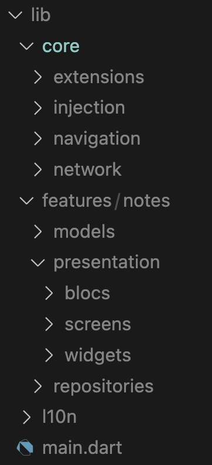

# notes_manager

This project is a simple notes manager that at the moment save notes in the local memory and manage. It also have support to be able to connect it in the future to a REST API.

The idea of the project even when it is simple is to give a solution the closer as possible to how a "real live" may be approched.

The first step to achieve it will be to plan how the architecture of the application should looks like:

Every **feature** will be divided into 3 layers: presentation, domain and data.

- **Presentation layer**: We need widgets to be able to display something on the screen. These widgets should dispatch events to the bloc and listen for changes in the state of the bloc. They should be rebuilt if the state change.
- **Domain Layer**: The domain layer in an inner layer responsible for getting data from the backend and converted based on the frontend needs.
- **Data Layer**: The data layer should contain the repository implementation which should be able to handle read, save and remove data for the local memory as weel as operations —GET, PUSH, PUT, DELETE— related to the API.

As a result of the architecture previously described, the project structure will be something like:

In any application keeping the logic separated from the visual elements, handeling errors properly, documenting the code, and testing the funtionalities makes our code much more cleaner, easy to understand for other developers and maintainable in the future.

For handeling the errors properly, the [package dartz](https://pub.dev/packages/dartz) is really useful. It allows as to use Functional programming in Dart and in this case is being used in the project to return either an error or the respective model when the response from the SharedPref or ApiManager fails or success respectively.

For generating the documentation the [package dartdoc](https://pub.dev/packages/dartdoc) is really handy.
